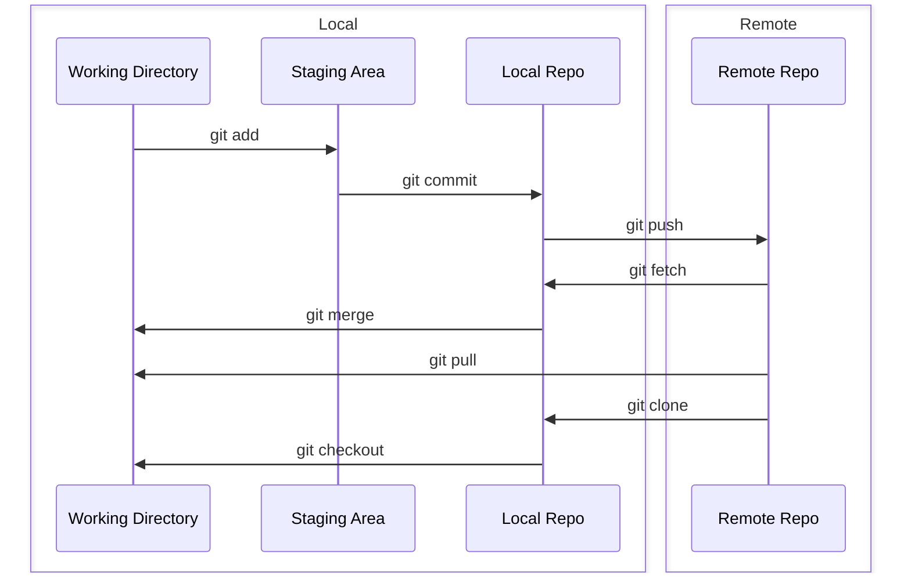

```ts twoslash title=blog.ts
console.log(1);
console.log(2);
//     ^?

import { rendererRich, transformerTwoslash } from '@shikijs/twoslash';

transformerTwoslash({
  renderer: rendererRich(), // <--
});

import {
  transformerNotationDiff,
  // ...
} from '@shikijs/transformers';

const code = `console.log('hello')`;
```

```js
console.log(1); // [!code ++]
console.log(1); // [!code --]
console.log(1); // [!code highlight]
console.log(1); // [!code error]
console.log(1); // [!code warning]
```

```js
console.log(1);
console.log(1); // [!code focus]
console.log(1);
```

# Heading 1

## Heading 2

### Heading 3

#### Heading 4

##### Heading 5

###### Heading 6

:::code-group-open

```bash [npm]
 npm install @nuxtjs/html-validator --save-dev
```

```bash [yarn]
 yarn add @nuxtjs/html-validator --dev
```

```bash [pnpm]
 pnpm i -D @nuxtjs/html-validator
```

```bash [bun]
 bun install @nuxtjs/html-validator --save-dev
```

:::code-group-close

:::code-group-open

```js
const a = 2;
```

```ts
const a: number = 2;
```

:::code-group-close

## Heading 2



> [!NOTE]
> Highlights information that users should take into account, even when skimming.

> [!TIP]
> Optional information to help a user be more successful.

> [!IMPORTANT]
> Crucial information necessary for users to succeed.

> [!WARNING]
> Critical content demanding immediate user attention due to potential risks.

> [!CAUTION]
> Negative potential consequences of an action.

# Katex

# Maxwell's Equations

| equation                                                                                                                                                                  | description                                                                            |
| ------------------------------------------------------------------------------------------------------------------------------------------------------------------------- | -------------------------------------------------------------------------------------- |
| $\nabla \cdot \vec{\mathbf{B}}  = 0$                                                                                                                                      | divergence of $\vec{\mathbf{B}}$ is zero                                               |
| $\nabla \times \vec{\mathbf{E}}\, +\, \frac1c\, \frac{\partial\vec{\mathbf{B}}}{\partial t}  = \vec{\mathbf{0}}$                                                          | curl of $\vec{\mathbf{E}}$ is proportional to the rate of change of $\vec{\mathbf{B}}$ |
| $\nabla \times \vec{\mathbf{B}} -\, \frac1c\, \frac{\partial\vec{\mathbf{E}}}{\partial t} = \frac{4\pi}{c}\vec{\mathbf{j}}    \nabla \cdot \vec{\mathbf{E}} = 4 \pi \rho$ | _wha?_                                                                                 |
